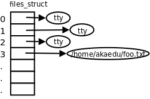

## 文件与IO 和 文件系统

很多 C 的函数是没法用 C 语言实现的，例如C代码中的write函数是系统调用的包装函数，其内部实现就是把传进来的三个参数分别赋给ebx、ecx、edx寄存器，然后执行movl $4,%eax和int $0x80两条指令。这个函数不可能完全用C代码来写，因为任何C代码都不会编译生成int指令，所以这个函数有可能是完全用汇编写的，也可能是用C内联汇编写的，甚至可能是一个宏定义（省了参数入栈出栈的步骤）


用户程序在读写文件时既可以调用C标准I/O库函数，也可以直接调用底层的Unbuffered I/O函数，那么用哪一组函数好呢？

用Unbuffered I/O函数每次读写都要进内核，调一个系统调用比调一个用户空间的函数要慢很多，所以在用户空间开辟I/O缓冲区还是必要的，用C标准I/O库函数就比较方便，省去了自己管理I/O缓冲区的麻烦。

用C标准I/O库函数要时刻注意I/O缓冲区和实际文件有可能不一致，在必要时需调用fflush(3)。

我们知道UNIX的传统是Everything is a file，I/O函数不仅用于读写常规文件，也用于读写设备，比如终端或网络设备。在读写设备时通常是不希望有缓冲的，例如向代表网络设备的文件写数据就是希望数据通过网络设备发送出去，而不希望只写到缓冲区里就算完事儿了，当网络设备接收到数据时应用程序也希望第一时间被通知到，所以网络编程通常直接调用Unbuffered I/O函数。

C标准库函数是C标准的一部分，而Unbuffered I/O函数是UNIX标准的一部分，在所有支持C语言的平台上应该都可以用C标准库函数（除了有些平台的C编译器没有完全符合C标准之外），而只有在UNIX平台上才能使用Unbuffered I/O函数，所以C标准I/O库函数在头文件stdio.h中声明，而read、write等函数在头文件unistd.h中声明。在支持C语言的非UNIX操作系统上，标准I/O库的底层可能由另外一组系统函数支持，例如Windows系统的底层是Win32 API，其中读写文件的系统函数是ReadFile、WriteFile。

现在该说说文件描述符了。每个进程在Linux内核中都有一个task_struct结构体来维护进程相关的信息，称为进程描述符（Process Descriptor），而在操作系统理论中称为进程控制块（PCB，Process Control Block）。task_struct中有一个指针指向files_struct结构体，称为文件描述符表，其中每个表项包含一个指向已打开的文件的指针，如下图所示。



> 事实上Unbuffered I/O这个名词是有些误导的，虽然write系统调用位于C标准库I/O缓冲区的底层，但在write的底层也可以分配一个内核I/O缓冲区，所以write也不一定是直接写到文件的，也可能写到内核I/O缓冲区中，至于究竟写到了文件中还是内核缓冲区中对于进程来说是没有差别的，如果进程A和进程B打开同一文件，进程A写到内核I/O缓冲区中的数据从进程B也能读到，而C标准库的I/O缓冲区则不具有这一特性。


``` cpp
#include <sys/types.h>
#include <sys/stat.h>
#include <fcntl.h>

int open(const char *pathname, int flags);
int open(const char *pathname, int flags, mode_t mode);
```

`open/close`, `read/write`, `lseek`, `fcntl`, `ioctl`, `mmap` 等是 syscall 的函数不是 C 语言中的函数。

