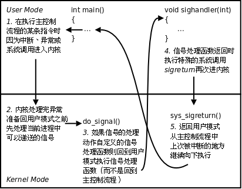

## 信号

> 这部分真的太重要了

`kill -l` 可以查看所有信号，每个信号都有一个编号和一个宏定义名称，这些宏定义可以在signal.h中找到。这些信号各自在什么条件下产生，默认的处理动作是什么，在signal(7)中都有详细说明。

- 用户在终端按下某些键时，终端驱动程序会发送信号给前台进程，例如Ctrl-C产生SIGINT信号，Ctrl-\产生SIGQUIT信号，Ctrl-Z产生SIGTSTP信号（可使前台进程停止）
- 硬件异常产生信号，这些条件由硬件检测到并通知内核，然后内核向当前进程发送适当的信号。例如当前进程执行了除以0的指令，CPU的运算单元会产生异常，内核将这个异常解释为SIGFPE信号发送给进程。再比如当前进程访问了非法内存地址，，MMU会产生异常，内核将这个异常解释为SIGSEGV信号发送给进程。
- 当内核检测到某种软件条件发生时也可以通过信号通知进程，例如闹钟超时产生SIGALRM信号，向读端已关闭的管道写数据时产生SIGPIPE信号。

如果不想按默认动作处理信号，用户程序可以调用sigaction(2)函数告诉内核如何处理某种信号（sigaction函数稍后详细介绍），可选的处理动作有以下三种：

1. 忽略此信号。
2. 执行该信号的默认处理动作。
3. 提供一个信号处理函数，要求内核在处理该信号时切换到用户态执行这个处理函数，这种方式称为捕捉（Catch）一个信号。

### 阻塞信号

POSIX.1允许系统递送该信号一次或多次。Linux是这样实现的：常规信号在递达之前产生多次只计一次，而实时信号在递达之前产生多次可以依次放在一个队列里

sigset_t类型对于每种信号用一个bit表示“有效”或“无效”状态，至于这个类型内部如何存储这些bit则依赖于系统实现，从使用者的角度是不必关心的，使用者只能调用以下函数来操作sigset_t变量，而不应该对它的内部数据做任何解释，比如用printf直接打印sigset_t变量是没有意义的。

``` cpp
#include <signal.h>

int sigemptyset(sigset_t *set);
int sigfillset(sigset_t *set);
int sigaddset(sigset_t *set, int signo);
int sigdelset(sigset_t *set, int signo);
int sigismember(const sigset_t *set, int signo);
```

信号处理过程: 

### sigaction

``` cpp
#include <signal.h>

int sigaction(int signo, const struct sigaction *act, struct sigaction *oact);
```

### pause

``` cpp
#include <unistd.h>

int pause(void);
```

pause函数使调用进程挂起直到有信号递达。如果信号的处理动作是终止进程，则进程终止，pause函数没有机会返回；如果信号的处理动作是忽略，则进程继续处于挂起状态，pause不返回；如果信号的处理动作是捕捉，则调用了信号处理函数之后pause返回-1，errno设置为EINTR，所以pause只有出错的返回值

### SIGCHLD信号

其实，子进程在终止时会给父进程发SIGCHLD信号，该信号的默认处理动作是忽略，父进程可以自定义SIGCHLD信号的处理函数，这样父进程只需专心处理自己的工作，不必关心子进程了，子进程终止时会通知父进程，父进程在信号处理函数中调用wait清理子进程即可。